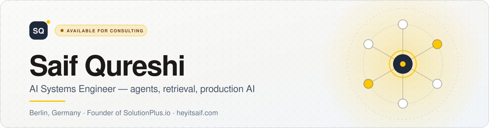

<picture>
  <source media="(prefers-color-scheme: dark)" srcset="assets/banner-dark.svg">
  <source media="(prefers-color-scheme: light)" srcset="assets/banner-light.svg">
  
</picture>

 

  

 

## Hey, I'm Saif

I design, build, and run **AI systems end-to-end** — agents, retrieval, observability, and cost-aware operations — across React, Node, and data layers.

My roots are in full-stack and mobile delivery for product teams across the US, UK, and EU. That's where the discipline of contracts, tests, and operations was built, and it still anchors every AI system I ship today. The last few years have gone deep on AI: agents, retrieval pipelines, and embedded assistant UIs wired into ads platforms, CRMs, calendars, and internal APIs.

I'm based in Berlin, and I also run **[SolutionPlus.io](https://solutionplus.io)** — a software solutions company that extends delivery capacity beyond just me.

> ### "Outcomes you can defend, maintain, and scale — not demos."

 

## What I build

|  | Practice | What that means in production |
|:--|:--|:--|
| **01** | **AI platforms & agent orchestration** | Multi-agent workflows with planning, memory, typed tool calls, and human checkpoints. Long-running work on durable engines like Temporal, alongside real-time product surfaces. |
| **02** | **Hybrid RAG & retrieval engineering** | Vector + relational retrieval, semantic chunking, and re-ranking so LLM outputs stay grounded when catalogues and documents get large. Retrieval changes ship with evals and tracing. |
| **03** | **Data ingestion & API integrations** | Schedulers, retries, dead-letter queues, and normalised pipelines from ads APIs, social platforms, and internal services — built for scale and observability. |
| **04** | **Embedded AI & browser assistants** | Chrome extensions and sidepanel experiences with in-browser RAG and real actions via scoped tool gateways — not another detached chat tab. |
| **05** | **Product engineering & SaaS delivery** | Full-stack delivery from editor UX and PDF correctness to billing, credits, tenancy, and SEO-strong marketing sites. |
| **06** | **Cost, evals & production safety** | Model routing, budgets, caching strategy, and auditability so AI products survive real traffic, real reviews, and finance scrutiny. |

 

---

 

# Case studies

Four systems I've taken from idea to production. Each links to a full write-up with architecture, AI internals, and outcomes.

 

###  Parker AI — AI-native marketing intelligence

  

> Multi-agent platform that turns TikTok, Instagram, and Meta signal into shippable creative for high-spend DTC brands.

**The problem** — High-spend Meta advertisers run out of creative ideas faster than they can ship them. Existing tools either summarise the past or generate generic content. Parker connects what brands and creators are doing *now* to what should be tested *next*.

**What I built**
- Multi-source ingestion across TikTok, Instagram, Facebook, Reddit, competitor sites, reviews, and Meta ad performance — running on **Temporal** with schedulers, backoff, retries, and dead-letter queues.
- A **hybrid retrieval layer** combining Qdrant vector search with Supabase Postgres relational data: semantic chunking, embedding serialisation, and query-aware re-ranking.
- **Agentic ideation on Mastra** that generates hooks, scripts, angles, and full briefs, plus a reusable idea bank with status tracking and cross-campaign reuse.
- **Slack-first delivery** — proactive alerts, weekly strategist reports, and ad-performance digests where the team already works.
- An **eval harness on Langfuse**: every prompt change ships with traces, cost, and quality metrics.

**Outcomes**
- Powers creative strategy for brands at up to **$2M/month Meta ad spend**.
- Idea turnaround compressed **from days to minutes**.
- Improved token and workflow efficiency through eval-informed prompt tuning and caching decisions.
- Became the foundation the rest of the engineering team builds on.

`Mastra` `Temporal` `Qdrant` `Supabase Postgres` `Redis` `Langfuse` `Next.js` `Node.js` `TypeScript` `GCP` `Meta Marketing API` `Slack`

<b>Architecture & AI internals</b>

 

- **AI & orchestration** — Mastra agent runtime, Temporal durable workflows, Langfuse evals + tracing, MCP-style tool calls.
- **Data** — Supabase Postgres, Qdrant vector store, Redis hot state, Cloud Storage raw blobs.
- **Application** — Next.js dashboard, Node/TypeScript services, Slack app.
- **Infra** — GCP, Cloud Run, Cloud Functions.
- **Agent design** — planning, memory, tool-use, and human-in-the-loop checkpoints; custom tools for ads APIs, internal data, competitor research, and creative review.
- **Safety & cost** — typed and traced tool calls, budget caps, explicit memory scopes, and human checkpoints on high-impact actions such as client emails.

**[Read the case study →](https://www.heyitsaif.com/projects/parker-ai)**  ·  **[Live site ↗](https://heyparker.ai/)**

 

###  Get Magic — enterprise AI co-pilot

  

> The AI co-pilot that scales Magic's 24/7 executive-assistant service — embedded assistant surfaces with RAG, memory, and real tool actions.

**The problem** — Executive assistants live in dozens of tools: Gmail, Calendar, CRMs, client docs. Tab-switching to a separate AI chat breaks flow. Magic needed AI to live *where the work happens*, with full context and the ability to take action.

**What I built**
- The **Magic Assistant browser extension** on Plasmo — a true co-pilot that is context-aware, memory-aware, and able to act through tool calls.
- An **open-floor team-wide assistant** any assistant can ask, grounded in playbooks and historical tickets.
- **In-browser RAG on IndexedDB** so sensitive context never leaves the user's device when it doesn't have to.
- **MCP-style tool servers** wiring agents to CRM, calendar, email, and internal Magic APIs, with scoped access and full audit trails.
- **Prompt-safety processor layers** (detection + scrubbing) to reduce prompt-injection risk in tool-enabled assistants.

**Outcomes**
- Reduced research and drafting time per assistant ticket.
- Standardised reuse of playbooks across the assistant team.
- Improved reliability of multi-tool assistant runs through scoped gateway patterns and feature-flagged rollout.

`Plasmo` `IndexedDB` `Vector Search` `MCP` `AWS Lambda` `Cloudflare Workers` `React` `TypeScript` `OpenAI` `Anthropic`

<b>Architecture & AI internals</b>

 

- **Extension** — Plasmo, React, TypeScript, IndexedDB.
- **Tooling** — MCP-style servers with CRM, calendar, and email adapters.
- **Infra** — AWS Lambda, Cloudflare Workers, DynamoDB, S3 — edge-deployed for low latency.
- **Retrieval** — hybrid retrieval over playbooks, tickets, and client preferences.
- **Privacy-first design** — data minimisation, PII scrubbing, and least-privilege tool calls.
- **Enterprise surfaces** — dynamic sidepanel tooling with prompt-aware tool routing, internal feature-flag gates, and competitive-intelligence views.

**[Read the case study →](https://www.heyitsaif.com/projects/get-magic)**  ·  **[Live site ↗](https://getmagic.com/)**

 

###  Bewerbung.AI — Germany's AI application platform

  

> Agent-driven Lebenslauf and Anschreiben, job-fit coaching, Lambda PDF export, and analytics — tuned to German hiring conventions.

**The problem** — German Bewerbungen follow specific conventions and expectations. Generic résumé builders miss format, tone, and role fit. Candidates need real Lebenslauf and Anschreiben quality, an honest job-fit check against postings, and exports they can trust — without hiring expensive coaches.

**What I built**
- A full **AI Lebenslauf editor** with section-level rewriting, live preview, and clean multi-template PDF output.
- **Agent-side Anschreiben generation** — dedicated cover-letter agents and V2 state parity, personalising tone, structure, and role-specific arguments for German formality.
- **Job-fit check** — coaching agents grade applications against role requirements with gap analysis, discovery, and interview prep, so candidates know what to fix *before* they apply.
- **AWS Lambda PDF jobs** that offload CPU-heavy export from the Express API, with layout preservation on save.
- **Stripe paywall and a credits system** metering AI usage, plus eval-driven prompt versioning so quality regressions and runaway inference spend get caught early.

**Outcomes**
- Made high-quality German Bewerbungen accessible without expensive coaches.
- Cut time-to-application **from hours to minutes** with agent-assisted Anschreiben and trustworthy PDF exports.
- Improved submission quality through job-fit checks and proactive coaching loops.
- Kept SaaS unit economics healthy via credits, deferred analytics, and Lambda-backed PDF generation.

`React` `RSPack` `Redux Toolkit` `RTK Query` `Node.js` `Express` `MongoDB` `AWS Lambda` `Stripe` `Postmark` `Statsig` `Mixpanel` `Sentry`

<b>Architecture & AI internals</b>

 

- **Frontend** — React + RSPack, TypeScript, Tailwind, Redux Toolkit, RTK Query, Formik.
- **Backend** — Node.js, Express, MongoDB, PM2 cluster.
- **Agents** — cover-letter agents tied to resume context and target role; coaching agents for job-fit scoring and section-level rewrites; a proactive email agent that scans application state and surfaces the highest-impact next steps.
- **Export & infra** — AWS Lambda PDF jobs, template-safe render pipeline, GitHub Actions deploys.
- **Product & analytics** — Stripe paywall and credits, Postmark email, Statsig experimentation, Mixpanel, Sentry — deferred and isolated in vendor chunks so instrumentation never dominates main-thread work.

**[Read the case study →](https://www.heyitsaif.com/projects/bewerbung-ai)**  ·  **[Live site ↗](https://bewerbung.ai/)**

 

###  QuickBilling — solo-built billing SaaS

  

> Invoices, quotes, expenses, and secure client links in one workspace — with a public OpenAPI. Built solo from zero to production.

**The problem** — Generic tools are either accountant-heavy or too shallow for real client workflows. QuickBilling targets the middle: fast professional documents, honest expense visibility next to receivables, and shareable links with analytics — without pretending to be a full general ledger.

**What I built**
- **Invoices and estimates** with line items, taxes, discounts, and brandable templates.
- **Secure share links** with open tracking and PDF export, plus quote-to-invoice conversion.
- **Expense tracking** as a first-class module alongside receivables, so money out and money in live in one workspace.
- **Team workspaces** with Row Level Security tenant boundaries on Supabase.
- A **public REST API with OpenAPI spec**, documented at `quickbilling.io/docs` for integrations and automation.
- **Stripe subscriptions** with webhook reconciliation, across marketing, app, docs, and API surfaces.

**Outcomes**
- Live product from **zero → production**, solo — marketing site, application, docs, and API.
- Positioned for freelancers and small businesses: fast send, professional presentation, expenses and invoicing together.
- Shipped with operational discipline: staging/production parity, a documented API, and cost-aware SaaS patterns.

`Next.js` `TypeScript` `Supabase` `PostgreSQL` `Row Level Security` `Stripe` `OpenAPI` `Vercel` `Tailwind CSS`

**[Read the case study →](https://www.heyitsaif.com/projects/quickbilling)**  ·  **[Live site ↗](https://quickbilling.io/)**

 

### More work

| Project | What it is | Stack |
|:--|:--|:--|
| **[getSimplePay](https://www.heyitsaif.com/projects/getsimplepay)** | Shopify app and checkout extensions for US bank-pay — merchant admin on Polaris, payment customization functions, and ACH positioning. | `Shopify CLI` `Shopify Functions` `Checkout UI Extensions` |
| **[Manzil](https://www.heyitsaif.com/projects/manzil)** | Goals-based halal investing from the Aghaz monorepo — mobile app, API, Plaid funding, and admin ops; now Manzil Invest. | `React Native` `Redux` `Node.js` `PostgreSQL` |
| **[Bindr.uk](https://www.heyitsaif.com/projects/bindr)** | Product built end-to-end with a team of three, from realtime video to chat. | `React` `Node.js` `GraphQL` `Jitsi` `StreamChat` |
| **[Microservices Chat](https://www.heyitsaif.com/projects/microservices-realtime-chat)** | Docker/Kubernetes microservices with Firebase-backed realtime chat, Redis IPC, and a dynamic web crawler. | `Docker` `Kubernetes` `Node.js` `Redis` `Firebase` |

**[Browse the full project index →](https://www.heyitsaif.com/projects)**

 

---

 

## What I'm passionate about

**Production over demos.** Anyone can get a model to say something impressive once. The job is systems that survive real traffic and real scrutiny: typed and traced tool calls, evals on every model change, cost and latency dashboards, human checkpoints on risky actions, and runbooks a team can operate without me.

**Grounded answers.** Retrieval is where most AI products quietly fail. I care about hybrid stores, honest chunking, query-aware re-ranking, and measuring whether quality actually moved — instead of hoping it did.

**Cost as a first-class feature.** Model routing, caching strategy, prompt budgets, and usage guardrails tied to unit economics. An AI feature that can't survive a finance review isn't shipped.

**Safety and privacy by default.** Least-privilege tool scopes, PII hygiene, on-device stores when context is sensitive, and prompt-safety layers for anything that can take real actions.

**Product surfaces people actually use.** Side panels, workspaces, and dashboards with tool pickers, audit trails, and fast iteration loops — AI that lands where teams already work, not in yet another detached chat tab.

**Building a team, not just a codebase.** Through [SolutionPlus.io](https://solutionplus.io) I get to turn that same discipline into something other engineers can carry forward.

 

## Toolkit

**AI & agents**

**Data & retrieval**

**Frontend & product**

**Backend & APIs**

**Cloud, infra & delivery**

 

---

 

## SolutionPlus.io

**From idea to delivery.**

I founded **[SolutionPlus.io](https://solutionplus.io)** to turn uncertain software problems into working products teams can own.

German-led project leadership paired with a tight-knit engineering team, delivering MVPs, dedicated product teams, and modernization work — discovery, requirements, architecture, QA, and stakeholder alignment held to shared quality gates. You always own the code, the process, and the team.

`AI automation` `Web app development` `Mobile app development` `UI/UX design` `Workflow automation` `Systems integration` `Software consulting`

When an engagement needs more than one senior pair of hands, SolutionPlus extends delivery capacity beyond just me.

**[solutionplus.io ↗](https://solutionplus.io)**

 

---

 

## Working together

<b>What kind of work do you take on?</b>

 

Production AI systems, end-to-end: agent platforms and orchestration, hybrid RAG and retrieval, data ingestion and API integrations, embedded assistants and browser extensions, and full-stack SaaS delivery. Engagements usually start with one well-scoped milestone of four to twelve weeks.

<b>How does an engagement start?</b>

 

With a free 30-minute discovery call. You bring your stack, constraints, and goals; I map the workflow, flag the risks, and propose a first milestone with clear acceptance criteria. No pitch deck required — just your context and questions.

<b>Do you work remotely and across time zones?</b>

 

Yes. I'm based in Berlin, Germany (CET) and work with teams across the US, UK, and EU. Most collaboration runs asynchronously through Slack, GitHub, and your project tooling, with overlapping hours reserved for planning and reviews.

<b>What does "production AI" mean in practice?</b>

 

Systems that survive real traffic and real scrutiny: typed and traced tool calls, evals on every model change, cost and latency dashboards, human checkpoints on risky actions, and runbooks your team can operate without me. Demos are easy — maintained systems are the job.

<b>Which technologies do you use most?</b>

 

TypeScript across the stack: React and Next.js on the frontend, Node.js services, Temporal for durable workflows, Qdrant and Supabase Postgres for hybrid retrieval, Mastra for agent orchestration, Langfuse for tracing and evals, and AWS, GCP, and Cloudflare for infrastructure.

 

---

 

### Let's talk about your AI roadmap

Book a free 30-minute call to walk through what you're building, where you're stuck, 
and what a sensible next milestone looks like.

 

  

Berlin, Germany · Available for AI platform, assistant, and integration-heavy engagements

  

<b>[heyitsaif.com](https://heyitsaif.com)</b> · <b>[solutionplus.io](https://solutionplus.io)</b>

